## Screenshoot Before Optimization

- endpoint /all-student with JMeter
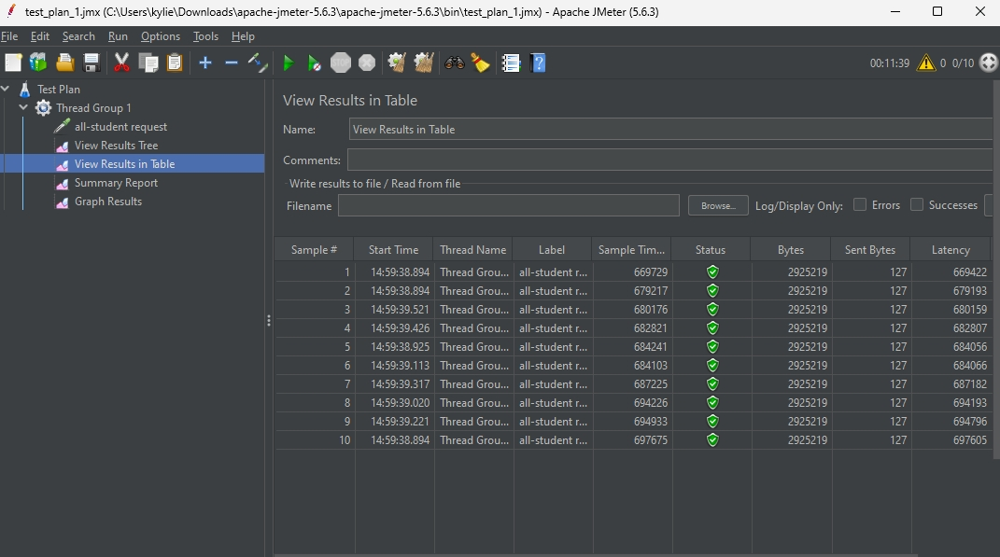

- endpoint /all-student-name with JMeter
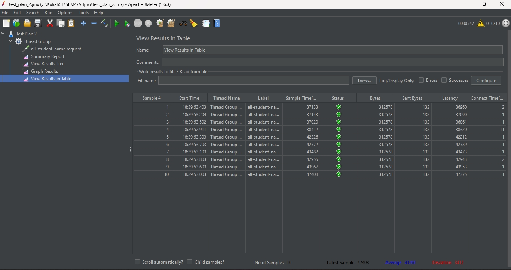

- endpoint /all-student-name with CLI
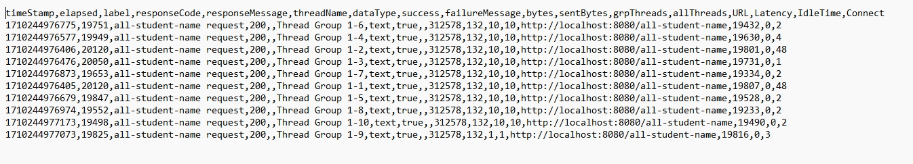

- endpoint /highest-gpa with JMeter
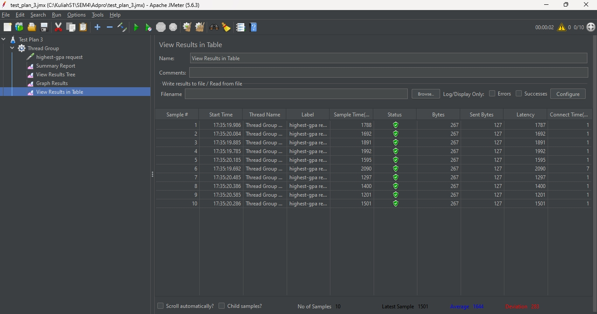

- endpoint /highest-gpa with CLI
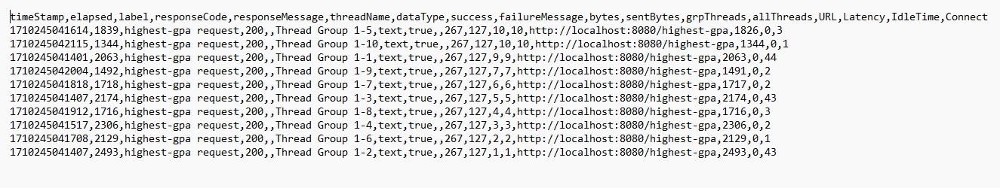

## Screenshot After Optimization

- performance optimization of endpoint /all-student
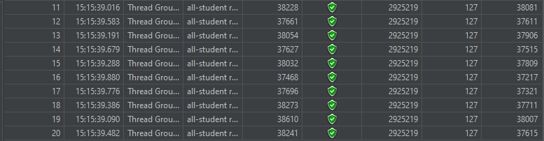
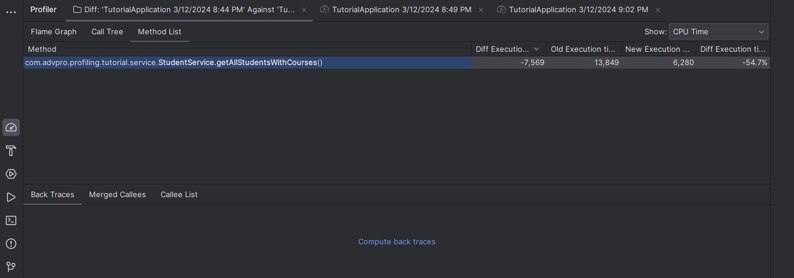

- performance optimization of endpoint /all-student-name
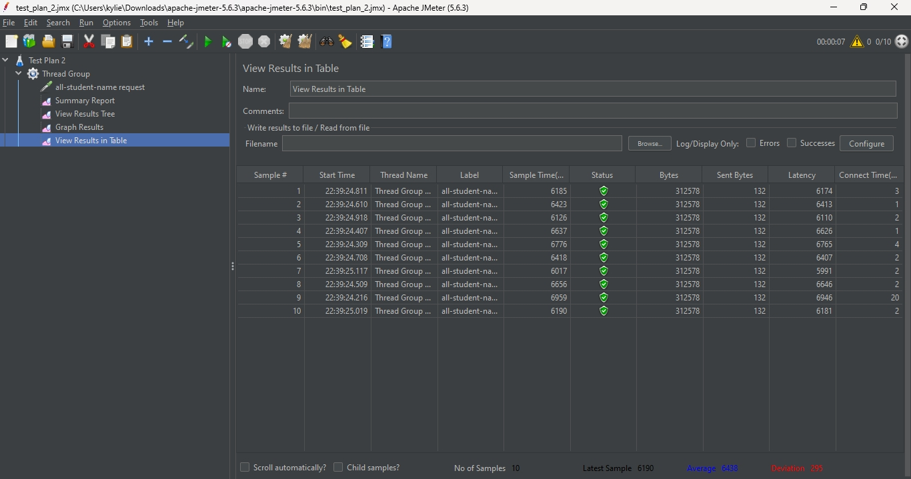
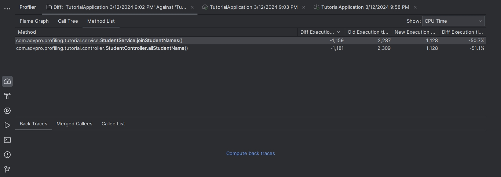

  
- performance optimization of endpoint /highest-gpa
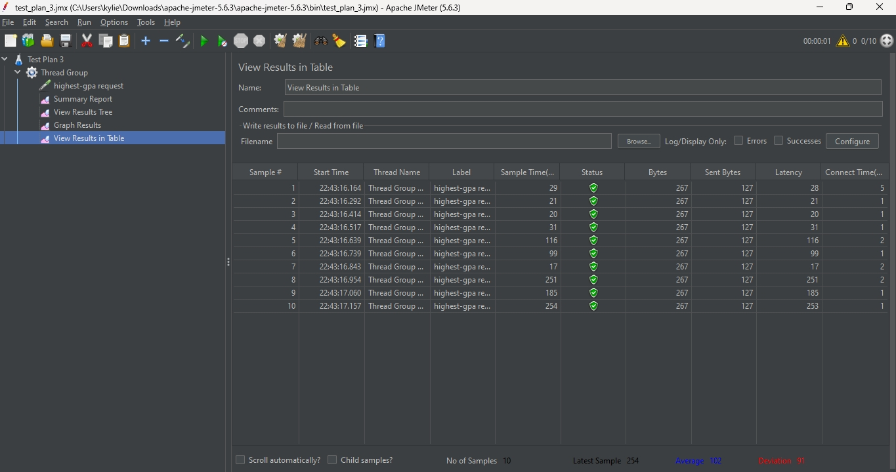
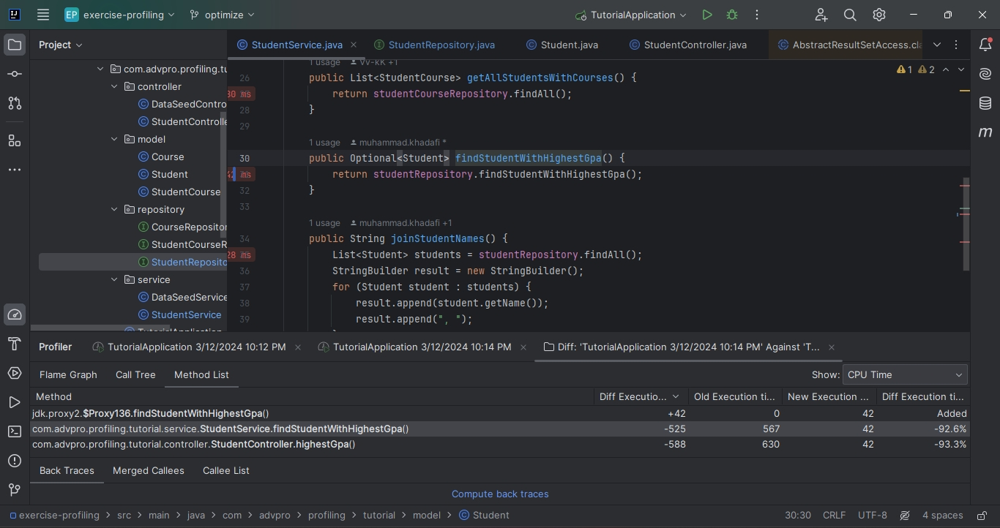

Jadi, dapat ditarik konklusi bahwa terjadi peningkatan performance pada hasil pengujian JMeter karena terlihat bahwa sample time atau load time nya mengalami penurunan.
Selain itu, CPU Time pada hasil profiling dengan IntelliJ profiller juga mengalami penurunan sehingga menjadi lebih cepat.

## Reflection
1. Performance testing menggunakan Intellij Profiler lebih detail dibandingan dengan JMeter karena dapat memberikan feedback berupa waktu yang dibutuhkan tiap method sedangkan JMeter hanya memberikan waktu sejak request diberikan hingga didapatkan respond.
Maka dari itu, performance testing menggunakan Intellij Profiler lebih bermanfaat bagi developer untuk mengoptimasi kodenya karena dapat mengetahui bagian mana yang tidak efisien.

2. Proses profiling membantu saya dengan menyediakan flame tree, method list, dan timeline untuk melihat bagian yang membutuhkan waktu lama dalam kode saya.
Hal ini membuat saya paham bagian yang perlu diubah agar menjadi lebih efisien dan tidak perlu mencoba-coba mengubah semua kode saya.

3. Ya, Intellij Profiler sangat efektif untuk membantu saya mengidentifikasi bottleneck dalam kode saya. Meskipun awalnya sedikit bingung, tetapi fitur-fitur yang disediakan sangat bermanfaat.
Saya bahkan dapat melihat line mana yang menghabiskan waktu terbanyak dalam suatu method. Hal ini sangatlah bermanfaat dalam saya mengetahui bagian yang bermasalah.

4. Tantangan utama yang saya hadapi adalah bingung dalam membaca outputnya dan bagian mana yang harus saya perhatikan untuk membantu menganalisis kode saya. Hal ini saya overcome dengan cara mencari berbagai sumber di internet dan membaca modul untuk lebih memahami arti dari outputnya.

5. Saya dapat dengan mudah dan cepat mengidentifikasi bagian kode yang mengalami bottleneck dibandingkan menebak-nebak jika menggunakan Intellij Profiler. 
Output yang diberikan profiler juga sangat detail seperti yang saya jelaskan sebelumnya sehingga sangat membantu bagi saya.
Selain itu, saya mendapatkan feedback instan dari kode yang saya perbaiki sehingga jika masih belum efisien bisa langsung saya cari solusi lain untuk memperbaikinya.

6. Saya mengatasi hal ini dengan tidak menggunakan hasil pertama kali saat menggunakan profiler karena JIT compiler pada 
JVM belum optimal sehingga lebih lambat. Maka dari itu, saya beberapa kali melakukan restart aplikasinya dan melakukan beberapa 
kali pemanggilan method pada tiap kali baru menjalankan aplikasi sebelum melakukan pengukuran.

7. Setelah menganalisis result dari profiling dan performance testing, saya fokus ke method yang membutuhkan waktu lama, khususnya line yang membutuhkan waktu paling lama dalam method tersebut.
Lalu, saya mencari alternatif untuk menjalankan kode itu, misalnya string biasa saya ubah dengan StringBuilder agar lebih efisien. 
Cara yang saya lakukan untuk memastikan kode yang saya ubah tidak mempengaruhi fungsionalitas aplikasi adalah dengan memastikan 
output sebelum dan sesudah mengubah kode itu tetap sama. Menurut saya, akan lebih ideal jika dibuat sebuah unit test untuk memastikan bahwa kode 
tetap berfungsi seperti yang seharusnya. Namun, karena kode ini masih cukup simpel, maka saya melakukan pengecekan secara manual.
